<!-- PROJECT LOGO -->
<br />
<div align="center">
  <a href="https://github.com/FedeCana00/SailingClub/">
    
  </a>

  <h3 align="center">Sailing club</h3>

  <p align="center">
    Java application for the management of a sailing club
    <br />
    <a href="https://github.com/FedeCana00/SailingClub/tree/master/doc"><strong>Explore the docs »</strong></a>
    <br />
    <br />
    <a href="#Installation">Installation</a>
    ·
    <a href="Use">Use</a>
    ·
    <a href="Screenshots">Screenshots</a>
  </p>
</div>

## Installation

To run the program's graphical client interface, you need to run the Client.java (package application.client) file, while to run the server, 
you need to run the Server.java (package application.server) file. <br>
To install and run the software use an IDE suitable for Java code (Eclipse https://www.eclipse.org/downloads/, NetBeans https://netbeans.apache.org/download/index.html,
IntelliJ https: // www.jetbrains.com/idea/download/#section=windows, etc.). <br>
When you have installed the IDE you prefer, you can run the program inside it by opening the java project in this folder and clicking the "Run" button. <br>
In order to use the project it is necessary to configure the environment for JavaFX. To do this, download JavaFX 17 from the link https://gluonhq.com/products/javafx/.
Then go to Help> Eclipse marketplace…, search and install e (fx) clipse. Select Properties of your current project> Java Build Path Property> Library> Classpath> 
Add External JARs and go to the lib directory of the previously downloaded JavaFX and add all the JAR files. Then Run> Run Configurations ...> Arguments and
paste in VM arguments 
```
--module-path "C: \ Program Files \ Java \ javafx-sdk-12.0.1 / lib" --add-modules javafx.controls, javafx.fxml
```
replacing the part in quotes with your path.<br>
The external libraries needed are JUnit 5 (https://junit.org/junit5/) and MySQL connector (https://dev.mysql.com/downloads/connector/j/).

## Use

- Each partner can log in and register on the system.
- Each partner can view, add and remove sailboats.
- Each partner can register his boats in a race proposed by the sailing club and view all his registrations.
- Each partner can pay the registration fees for races, storage and association.
- Each partner can view his notifications.
- Club staff can view information on partner, partner boats and partner payments.
- Club staff can send notifications informing partner about membership renewals.
- Club staff can view, add and remove races.

## Screenshots

<p align="center">
  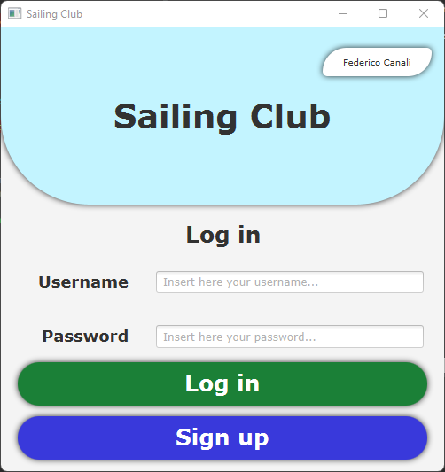
  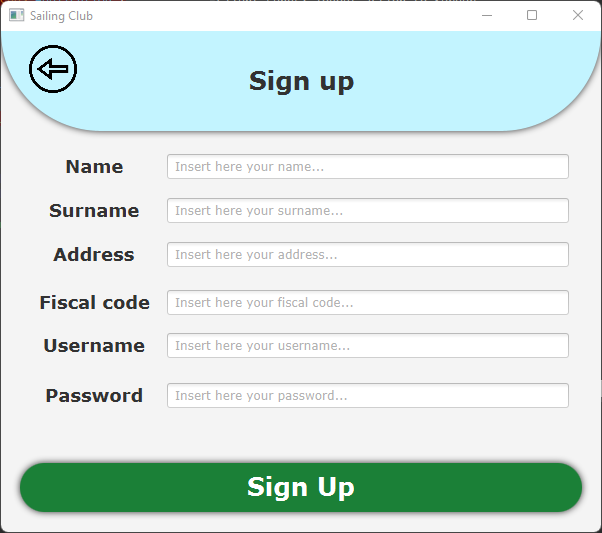
</p>

<p align="center">
  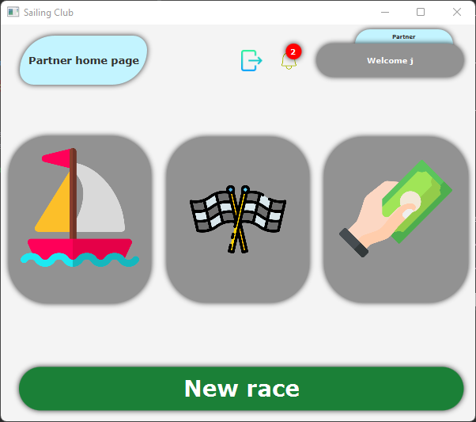
  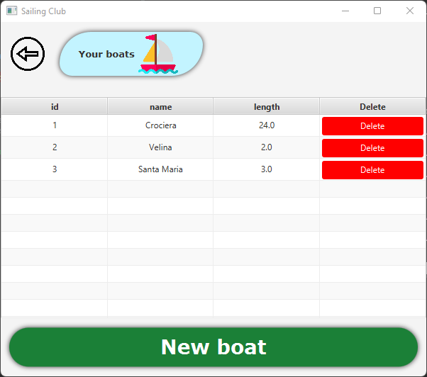
</p>

<p align="center">
  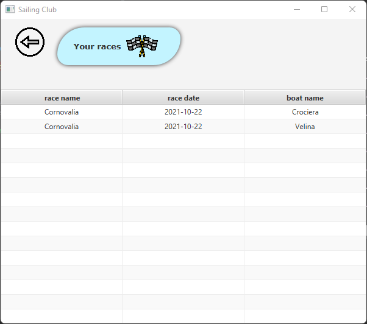
  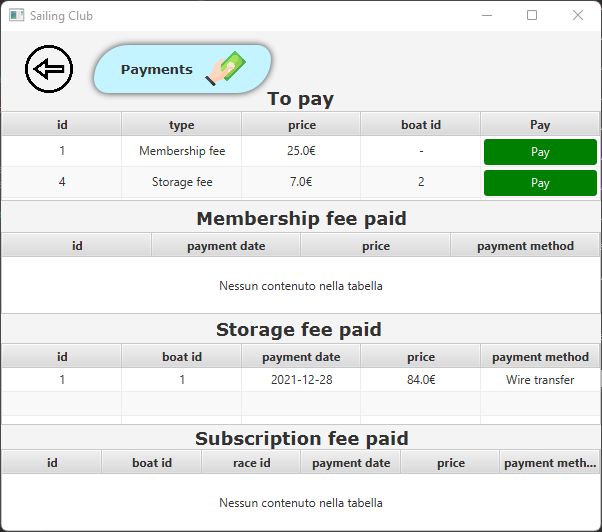
</p>

<p align="center">
  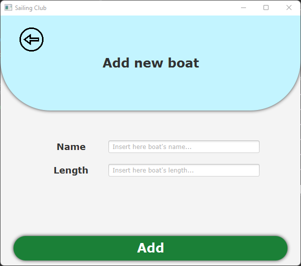
  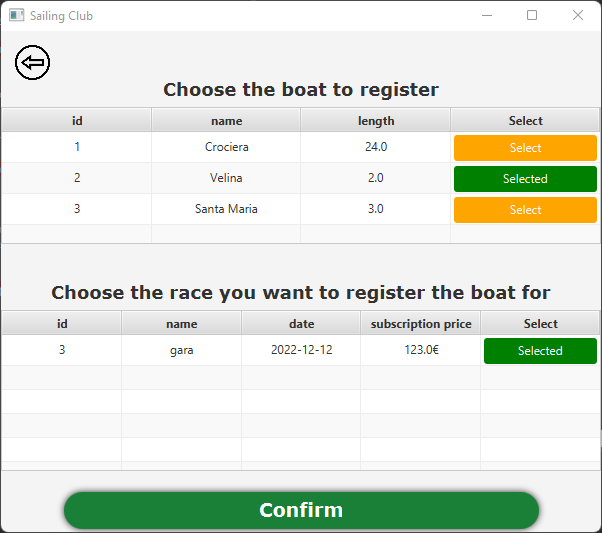
</p>

<p align="center">
  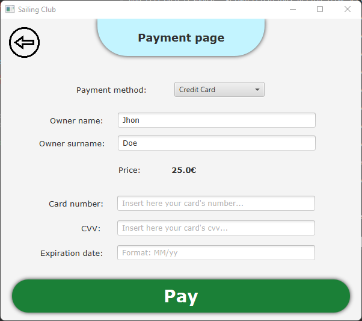
  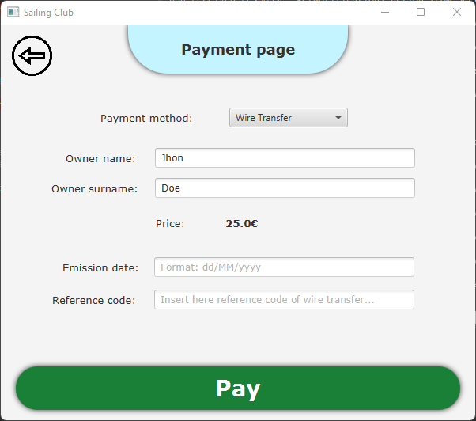
</p>

<p align="center">
  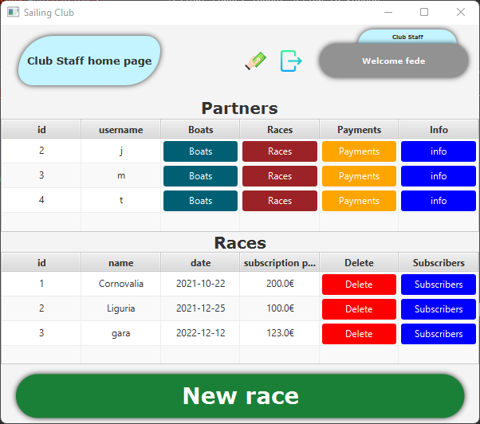
  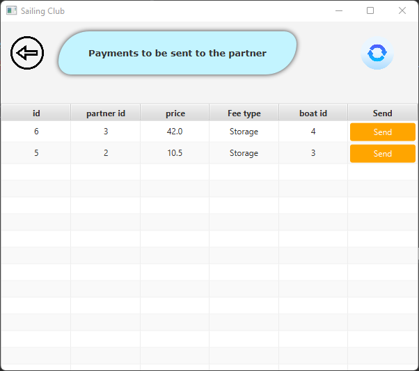
</p>

<p align="center">
  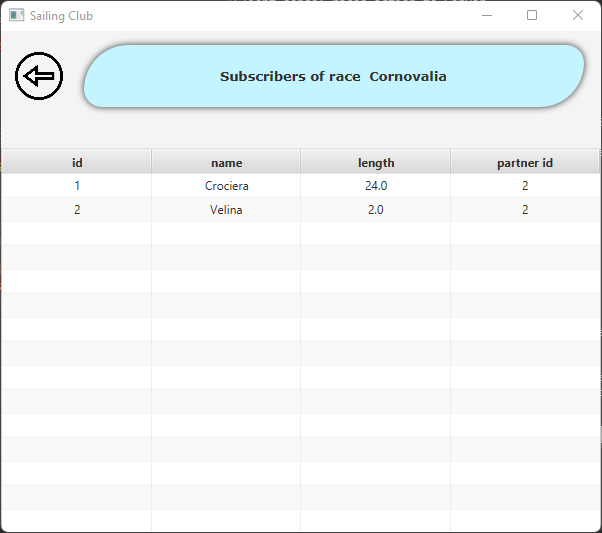
  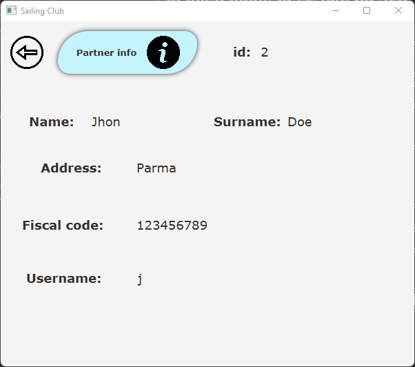
</p>

<p align="center">
  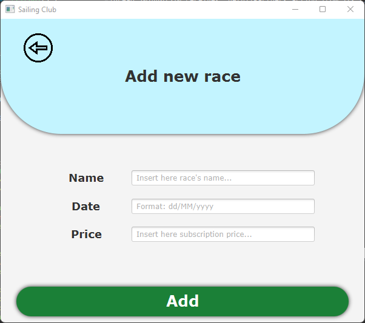
  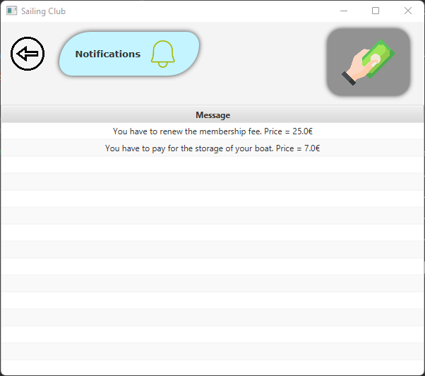
</p>

<!-- LICENSE -->
## License

Distributed under the MIT License. See `LICENSE.txt` for more information.

